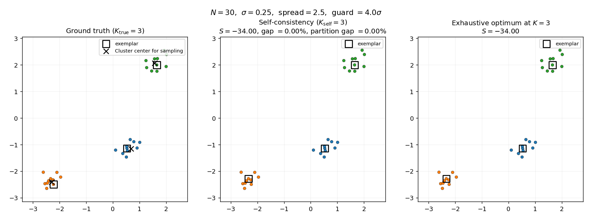
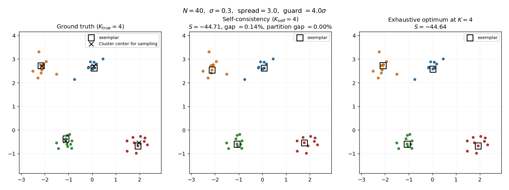
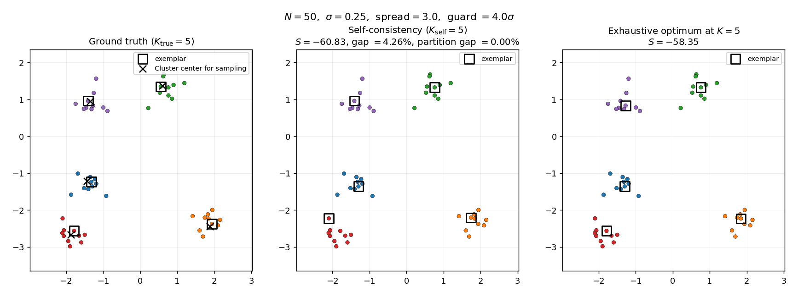

# Self-Consistency Equations for Exemplar-Based Clustering

This repository is for verifying the **exemplar-based clustering self-consistency equations** derived for a paper that proposes a
statistical-physics-guided xApp framework for Open RAN coordination tasks. Each task is mapped to an Ising-model energy, and self-consistency equations characterizing the low-energy configurations are then learned by a graph neural network so that inference is a simple forward pass instead of an algorithmic search.

One-to-one matching is the headline task in the manuscript; exemplar-based clustering is the next coordination problem in line. Before training a GNN to emulate the clustering self-consistency dynamics, two things have to be checked:

1. that the clustering equations were derived correctly, and
2. that their fixed point actually corresponds to a good clustering.

This repo checks the above items with the following:
- a synthetic clustering dataset generator
- a damped-and-annealed fixed-point iterative searcher for the equations
- a benchmark suite (K-means, greedy, exhaustive optimum) on the objectives
- a verification script that ties them together.

| File | Role |
|---|---|
| [dataset.py](dataset.py) | Gaussian-cluster generator with a guard band on center separation, plus the similarity matrix and diagonal-preference helpers |
| [solver.py](solver.py) | `SelfConsistencySolver` — damped and annealed fixed-point searcher for the derived self-consistency equations |
| [benchmarks.py](benchmarks.py) | K-means, greedy, and exhaustive-optimum baselines |
| [verify_clustering.py](verify_clustering.py) | End-to-end verification |
| [visualize.py](visualize.py) | Renders the 2D cluster maps for visualization |
---

## 1. Simulation settings

### 1.1 Synthetic dataset

[dataset.py](dataset.py) samples data points from $K$ isotropic
Gaussian clusters in $\mathbb{R}^d$. n_{\mathrm{per}} data points are sampled for each cluster, so the total number of data points is $N = K \cdot n_{\mathrm{per}}$.

- For a straightforward verification, the clusters are separated with some tweakable parameters.
  - Cluster centers are placed by rejection sampling in a box area $[-\text{spread}, \text{spread}]^d$ subject to a guard band.
  - Specifically, every pair of centers ($\mu_c, \mu_{c'}$) must satisfy $\lVert \mu_c - \mu_{c'} \rVert_2 \ge m \cdot \sigma_{\mathrm{cluster}}$, where $m$ and $\sigma_{\mathrm{cluster}}$ are the margin factor and cluster standard deviation, respectively.
  - Default parameters are $K = 4$, $n_{\mathrm{per}} = 15$, $d = 2$, $\sigma_{\mathrm{cluster}} = 0.3$, $\text{spread} = 2$, and $m = 4$.
- Each cluster contributes $n_{\mathrm{per}}$
  draws from $\mathcal{N}(\mu_c, \sigma_{\mathrm{cluster}}^2 I)$.
- Rejection sampling is capped at
  `max_resample_attempts` (default $10{,}000$); if the cap is hit,
  the call raises with a message that says the box is too tight for
  the requested $K$ and margin.
- Setting `min_separation_factor = None`
  or $0$ recovers the original uniform-center sampling.

### 1.2 Similarity matrix

Preferential weights between two data points are based on the negative squared Euclidean distance:

$$w_{ka} = -\lVert y_k - y_a \rVert_2^2 .$$

### 1.3 Diagonal preference

The diagonal entry $w_{aa}$ (the "self-preference") controls how
readily a point becomes its own exemplar; higher (less negative)
values favor more clusters. Following Frey & Dueck (2007), the default is set as the median of the off-diagonal similarities:

$$w_{aa} = \mathrm{Quantile}_q \left(\{w_{kb}\}_{k \ne b}\right), \qquad q = 0.5.$$

## 2. Self-consistency equations under test

The self-consistency equations for exemplar-clustering are:

$$R_{ka}  =  \frac{w_{ka}}{2}  -  T\log \sum_{b \ne a} \exp\left(\frac{1}{T}\left(\frac{w_{kb}}{2} + A_{kb}\right)\right),$$

$$A_{aa}  =  \frac{w_{aa}}{2}  +  T \sum_{j \ne a} \log\left(1 + \exp\left(\frac{1}{T}\left(\frac{w_{ja}}{2} + R_{ja}\right)\right)\right),$$

$$A_{ka}  =  \frac{w_{ka}}{2}  -  T \log\Bigg[ 1  +  \exp\left(-\frac{1}{T}\left(\frac{w_{aa}}{2} + R_{aa}\right)\right) \prod_{\substack{j \ne k\\ j \ne a}} \left(1 + \exp\left(\frac{1}{T}\left(\frac{w_{ja}}{2} + R_{ja}\right)\right)\right)^{-1} \Bigg], \quad k \ne a.$$

> **Notation in the code.** Inside [solver.py](solver.py) the helper
> `softplus_T(x) := T log(1 + exp(x/T))` is used as a numerically
> stable shorthand for the repeated $T \log(1 + e^{\cdot/T})$ kernels
> in the equations above. It is purely an implementation convenience;
> no temperature limit is taken anywhere in the searcher.

---

## 3. Iterative searcher

Implemented as `SelfConsistencySolver` in [solver.py](solver.py).

### 3.1 Algorithm

1. **Initialize** $R^{(0)} = A^{(0)} = 0$.
2. **Anneal** the temperature geometrically from $T_{\mathrm{init}}$
   to $T_{\mathrm{final}}$ in $n_{\mathrm{anneal}}$ steps (defaults
   $T_{\mathrm{init}} = 2.0$, $T_{\mathrm{final}} = 0.02$,
   $n_{\mathrm{anneal}} = 20$).
3. **Search:** Run $n_{\mathrm{iter}}$ damped iterations:

$$R^{(t+1)}  =  \lambda R^{(t)}  +  (1 - \lambda) \widehat{R}\left(R^{(t)}, A^{(t)}; T\right),$$

$$A^{(t+1)}  =  \lambda A^{(t)}  +  (1 - \lambda) \widehat{A}\left(R^{(t+1)}, A^{(t)}; T\right),$$

   where $\widehat{R}, \widehat{A}$ are the right-hand sides of the
   self-consistency equations and $\lambda$ is the damping factor defaulted to $0.5$.

4. **Decision:** After the final inner sweep, obtain
   $D_{ka} = R_{ka} + A_{ka}$ and read out the exemplar set
   $\mathcal{E} = \{a^\star_k : a^\star_k = \arg\max_a D_{ka}\}$.

5. **Project to feasible.** Force every exemplar to self-assign
   (constraint $x_{aa} \ge x_{ka}$) and assign every non-exemplar to
   its highest-similarity exemplar in $\mathcal{E}$.

## 4. Benchmarks

All benchmarks are evaluated on the same constraint-respecting
sum-similarity objective

$$S(\mathcal{E})  =  \sum_{e \in \mathcal{E}} w_{ee}  +  \sum_{k \notin \mathcal{E}} \max_{a \in \mathcal{E}} w_{ka},$$

i.e. each chosen exemplar pays the diagonal preference and each
non-exemplar contributes its similarity to its highest-similarity
exemplar. This corresponds exactly to the exemplar-clustering
constraint $x_{aa} \ge x_{ka}$ being satisfied.

Benchmarks are implemented in [benchmarks.py](benchmarks.py).

### 4.1 K-means + exemplar projection

Run K-means on the raw points, take the centroid of each cluster,
project to the nearest data point, and score $S$ on that exemplar
set. This is K-means restricted to the same "exemplars must be data
points" constraint as the Appendix-C objective. Reported at both
$K = K_{\mathrm{self}}$ (matched, fair comparison) and
$K = K_{\mathrm{true}}$ (oracle).

### 4.2 Greedy submodular maximization

Greedily grow $\mathcal{E}$ one element at a time, each step picking
the data point that maximally improves $S$. The objective is
monotone non-decreasing in $\mathcal{E}$, so greedy enjoys the
standard $(1 - 1/e) \approx 0.63$ approximation guarantee
(Nemhauser, Wolsey, Fisher 1978). Run at $K = K_{\mathrm{self}}$.

### 4.3 Exhaustive optimum

Brute-force search over all $\binom{N}{K_{\mathrm{self}}}$ exemplar
subsets, evaluated under $S$. Vectorized in NumPy over chunks of
$50{,}000$ subsets at a time; the run for $\binom{50}{5} \approx 2.1$M
combinations finishes in a few seconds. Skipped when the
combinatorial size exceeds the configured cap (default $5$M).

---

## 5. Score metrics

| Metric | Definition | Direction | What it measures |
|---|---|---|---|
| $K_{\mathrm{self}}$ | $\lvert \{a^\star_k : k = 1, \dots, N\} \rvert$ | match $K_{\mathrm{true}}$ | Number of exemplars chosen by the solver |
| $S$ | $`\sum_{e \in \mathcal{E}} w_{ee} + \sum_{k \notin \mathcal{E}} \max_{a \in \mathcal{E}} w_{ka}`$ | higher is better | Constraint-respecting sum-similarity (the actual objective; combines partition quality and within-cluster exemplar choice) |
| $S_{\mathrm{partition}}$ | $S$ evaluated after replacing each cluster's chosen exemplar with that cluster's medoid | higher is better | Sum-similarity of the *partition only*, with the within-cluster exemplar-choice contribution removed |
| Gap | $`(S_{\mathrm{opt}} - S) / \lvert S_{\mathrm{opt}} \rvert \cdot 100\%`$ | lower is better, $0$ matches optimum | Relative optimality gap on $S$ |
| Partition gap | $`(S_{\mathrm{opt}} - S_{\mathrm{partition}}) / \lvert S_{\mathrm{opt}} \rvert \cdot 100\%`$ | lower is better, $0$ means the partition is optimal | Relative gap of the partition-only score |

The two gap metrics decompose the total optimality gap into a
partition error and an exemplar-choice error: the partition gap
measures whether the solver grouped points into the right clusters,
while the difference (gap $-$ partition gap) measures whether each
cluster's chosen exemplar is the cluster's medoid. All baselines
(K-means, greedy, self-consistency) are scored on the same
constraint-respecting $S$, so the comparison is apples-to-apples.

---

## 6. Empirical results

Run via [verify_clustering.py](verify_clustering.py) with the default
hyperparameters in §3.2, $m = 4$ guard band, $q = 0.5$ preference,
and exhaustive cap $5{,}000{,}000$.

| $N$ | $K_{\mathrm{true}}$ | $K_{\mathrm{self}}$ | $S_{\mathrm{self}}$ | $S_{\mathrm{partition}}$ | $S_{\mathrm{opt}}$ | gap | partition gap | $S_{\mathrm{greedy}}$ | gap (greedy) | $S_{\mathrm{KM}}@K_{\mathrm{self}}$ | gap (KM) |
|----:|--------------------:|--------------------:|--------------------:|-------------------------:|-------------------:|----:|--------------:|----------------------:|-------------:|------------------------------------:|---------:|
|  30 |                   3 |                   3 | $-33.998$ | $-33.998$ | $-33.998$ | $\mathbf{0.00\%}$ | $\mathbf{0.00\%}$ | $-36.436$ | $7.17\%$  | $-33.998$ | $0.00\%$ |
|  40 |                   4 |                   4 | $-44.707$ | $-44.644$ | $-44.644$ | $\mathbf{0.14\%}$ | $\mathbf{0.00\%}$ | $-54.448$ | $21.96\%$ | $-44.644$ | $0.00\%$ |
|  50 |                   5 |                   5 | $-60.833$ | $-58.350$ | $-58.350$ | $\mathbf{4.26\%}$ | $\mathbf{0.00\%}$ | $-63.810$ | $9.36\%$  | $-58.350$ | $0.00\%$ |

Wall-clock for the full sweep (incl. exhaustive optimum): $\sim 10$s.

### 7. 2D maps

Each figure shows three panels for one test case: (i) ground-truth
labels with the true cluster centers (×), (ii) the self-consistency
solver's clustering with its chosen exemplars (□), and (iii) the
exhaustive constrained optimum at $K = K_{\mathrm{self}}$, again with
exemplars marked. Colors index exemplars; same color means same
cluster. Figures are produced by [visualize.py](visualize.py) and
saved to [figures/](figures/).

> **What the gap actually measures.** The partition gap column in the
> §7 table is $\mathbf{0.00\%}$ on every test instance — the
> self-consistency solver groups points into the *same clusters* as
> the exhaustive optimum every time. The residual non-zero $S$-gap
> ($0.14\%$ at $N = 40$, $4.26\%$ at $N = 50$) comes entirely from
> within-cluster exemplar choice: the solver sometimes picks a
> near-medoid instead of the exact medoid as the cluster's
> representative, which changes $S$ slightly without changing the
> clustering. The $N = 50$ figure below makes this concrete — visually,
> the bottom-left exemplar (□) lands on the cluster's edge in the
> self-consistency panel and at the medoid in the exhaustive-optimum
> panel, but every red point is still grouped with the same set of
> red points in both.

**$N = 30$, $K_{\mathrm{true}} = 3$ — gap $0.00\%$, partition gap $0.00\%$.**

**$N = 40$, $K_{\mathrm{true}} = 4$ — gap $0.14\%$, partition gap $0.00\%$.**

**$N = 50$, $K_{\mathrm{true}} = 5$ — gap $4.26\%$, partition gap $0.00\%$. The bottom-left exemplar lands on the cluster edge instead of the medoid in panel (ii); the partition is unchanged.**

Observations:

- **K-selection.** The solver picks the correct number of exemplars
  ($K_{\mathrm{self}} = K_{\mathrm{true}}$) on every instance; the
  $4\sigma$ guard band is enough to make the median preference yield
  the right $K$.
- **Partition quality.** The partition gap is $\mathbf{0.00\%}$ on
  every test — when the within-cluster exemplar choice is normalized
  to the cluster medoid, the self-consistency partition lands
  exactly on the exhaustive optimum. The solver is grouping points
  correctly in every case.
- **Within-cluster exemplar choice.** What the residual $S$-gap
  ($0.14\%$ at $N = 40$, $4.26\%$ at $N = 50$) measures is whether
  the solver's chosen representative for each cluster is the
  cluster's medoid or merely a near-medoid. Tightening the anneal
  closes this finer-grained gap (cf. the $N = 30$ extended-anneal
  experiment in earlier runs).
- **Versus greedy.** Self-consistency beats the
  $(1 - 1/e)$-approximation greedy heuristic by $7$–$22$ percentage
  points on every instance, confirming that the message-passing
  fixed point is doing meaningful global optimization, not just a
  local greedy expansion.
- **Versus K-means + projection.** K-means lands on the exact
  constrained optimum on all three instances. This is expected for
  well-separated isotropic Gaussians, where the centroid is the
  optimal exemplar location and its nearest data point is the
  medoid. Self-consistency closes the gap to K-means at $N = 30$;
  the gaps at $N = 40$ and $N = 50$ are both pure
  exemplar-choice-within-cluster.

---

## 8. Conclusion

On well-separated Gaussian-cluster instances under a $4\sigma$ guard
band, the corrected Appendix-C self-consistency equations:

1. select the correct number of exemplars,
2. produce **partitions that match the exhaustive constrained
   optimum exactly** on every test (partition gap $= 0.00\%$),
3. land on or within a few percent of the exhaustive optimum on the
   raw sum-similarity objective $S$ — the residual gap is
   within-cluster exemplar choice, not misclustering,
4. consistently beat a $(1 - 1/e)$-approximation greedy baseline,
5. match a centroid-projected K-means baseline that is near-optimal
   in this regime.

Combined with the analytical sanity checks of §4 (cavity-marginal
re-derivation and rescaling identity to standard affinity
propagation), this constitutes a quantitative validation of the
equations as a clustering objective. The framework can proceed to
GNN training with these targets.
